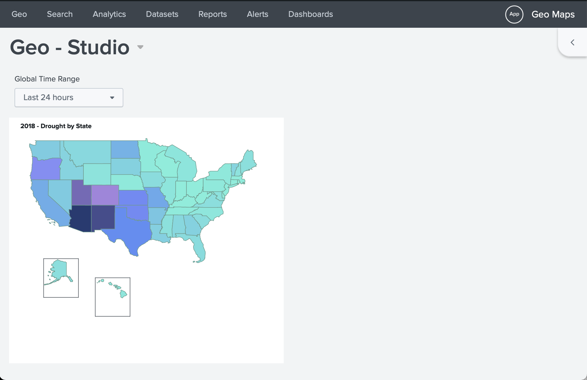

# splunk-geomaps

Demonstrate the use of choropleth and cluster visualizations

The app follows the instructions found in the [Splunk Documentation](https://docs.splunk.com/Documentation/Splunk/latest/Viz/GenerateMap).

## Installing the app
The app itself is avalable as a release labeled "latest".
To download the `geomaps.spl` file use: https://github.com/dd-Splunk/splunk-geomaps/releases/latest/download/geomaps.spl 

Then go to your Splunk instance and upload the file.
Splunk might ask to restart, just proceed with it.

After opening the Geo Maps app, the initial view should be similar to the following:


## Dashboard Studio map

A Dashboard Studio version of the first map is also available under the Dashboards tab.
It will render like this:




## To publish a new version of the app

After pushing all changes to Git, create a new version tag in the [SemVer format](https://semver.org): vx.y.z, and push it

```bash
git tag vx.y.z
git push --tags
````

This will initiate a new packaging of the app while embedding the version in the `app.conf` file.

## Testing with Docker

A `docker-compose.yml`is included. 
Execute the following to bring up your deployment:

```bash
$ SPLUNK_PASSWORD=<password> docker-compose up -d
```

